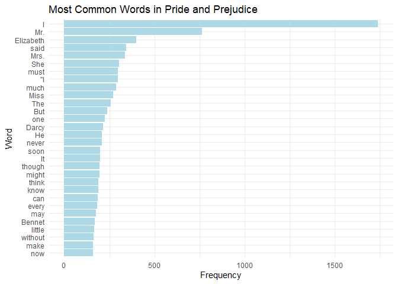
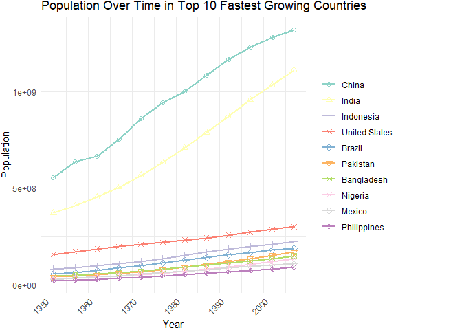

assignment-b4-mbeletsky
================
2024-12-04

# Welcome to Maria Beletsky’s Assignment B4 for STAT 545B at UBC (2024)

For this assignment, I will be completing Exercises 1 and 3 as described
on the [STAT 545
website](https://stat545.stat.ubc.ca/assignments/assignment-b4/).

## Exercise 1: Plotting Word Frequency in *Pride and Prejudice* by Jane Austen

For Exercise 1, I will use Jane Austen’s novel *Pride and Prejudice*
from the “janeaustenr” R package.

I will make a plot of the most common words in the book, removing “stop
words” (such as “the”, “a”, etc.) using the “stopwords” R package. Let’s
begin by loading the packages we need. We will also be using various
tidyverse packages such as “dplyr” for data wrangling and “ggplot2” for
plotting.

``` r
library(janeaustenr)
```

    ## Warning: package 'janeaustenr' was built under R version 4.4.2

``` r
library(stopwords)
```

    ## Warning: package 'stopwords' was built under R version 4.4.2

``` r
library(tidyverse)
```

    ## Warning: package 'stringr' was built under R version 4.4.2

    ## ── Attaching core tidyverse packages ──────────────────────── tidyverse 2.0.0 ──
    ## ✔ dplyr     1.1.4     ✔ readr     2.1.5
    ## ✔ forcats   1.0.0     ✔ stringr   1.5.1
    ## ✔ ggplot2   3.5.1     ✔ tibble    3.2.1
    ## ✔ lubridate 1.9.3     ✔ tidyr     1.3.1
    ## ✔ purrr     1.0.2     
    ## ── Conflicts ────────────────────────────────────────── tidyverse_conflicts() ──
    ## ✖ dplyr::filter() masks stats::filter()
    ## ✖ dplyr::lag()    masks stats::lag()
    ## ℹ Use the conflicted package (<http://conflicted.r-lib.org/>) to force all conflicts to become errors

First, let’s access *Pride and Prejudice*. We want all the words in
*Pride and Prejudice* as separate entries in a vector, so that we can
take out all the stop words. We will store the new vector in
“pap_fulltext”. We can view what we get with **head()**.

``` r
# Retrieve "Pride and Prejudice" and store in a vector

pap_fulltext <- janeaustenr::prideprejudice
head(pap_fulltext)
```

    ## [1] "PRIDE AND PREJUDICE" ""                    "By Jane Austen"     
    ## [4] ""                    ""                    ""

We now have the full text, but it is not split up by words. Now, let’s
make a new vector that contains all the individual words from the novel.
We can do this by using the **unlist()** and **strsplit()** functions to
split up words by indicating that we want everything separated by
spaces. We will use “\s+” to separate words by one or more white-space
characters.

``` r
# Split up the full text into individual words, stored in a new vector

pap_words <- unlist(strsplit(pap_fulltext, "\\s+"))
```

Now, we’re ready to remove stop words. I will first put a list of stop
words in English into a new vector called “stop_words_en”, and then make
a new version of “pap_words” that has the stop words taken out.

``` r
# Get a list of stop words in English

stop_words_en <- stopwords("en")

# Remove stop words from vector that has all individual words in the text

pap_words_clean <- pap_words[!(pap_words %in% stop_words_en)]

# View the first few words in the new vector
  
head(pap_words_clean)
```

    ## [1] "PRIDE"     "AND"       "PREJUDICE" "By"        "Jane"      "Austen"

We can successfully view our new cleaned dataset of words. Now we can
move on to making a plot of the most common words.

``` r
# Make our collection of words into a data frame so it's easier to work with
word_df <- data.frame(word = pap_words_clean, stringsAsFactors = FALSE)

# Count how many times each word appears
word_count <- word_df %>%
  count(word, sort = TRUE)

# Plot the most common words
ggplot(word_count[1:30, ], aes(x = reorder(word, n), y = n)) +  # Show the top 30 words
  geom_bar(stat = "identity", fill = "lightblue") + 
  coord_flip() +  # Flip the axes for better readability of words
  labs(title = "Most Common Words in Pride and Prejudice", x = "Word", y = "Frequency") +
  theme_minimal()
```

<!-- -->

And now we have our completed plot.

## Exercise 3: Modelling Population Trends by Country

For this exercise, I want to use the “gapminder” dataset to model each
country’s population over time. Let’s say we are interested in the
following research question:

**Which countries have had the most rapid population growth?**

First, we’ll load the “gapminder” dataset. We will be using the “purrr”
functional programming R package and the “broom” R package for help with
data manipulation and modelling, but they were already loaded when we
loaded “tidyverse” earlier so we don’t need to load them again.

``` r
library(gapminder)
```

Let’s try modelling population change over time for each country using a
linear fit. Fitting the data to a linear model will come up with
mathematical equations corresponding to the population growth of each
country, assuming that population changes in a linear fashion.

``` r
# Model population, considering each country as its own group
pop_model <- gapminder %>%
  group_by(country) %>% # Group data by country to model each one separately
  nest() %>% # Nest the data for each country because we will make 1 model per group
  mutate(model = map(data, ~ lm(pop ~ year, data = .))) %>% # Apply a linear model to each country's data with lm(), storing it into a new column
  select(country, model) # Keep only the country and model columns

# View what we've made
head(pop_model)
```

    ## # A tibble: 6 × 2
    ## # Groups:   country [6]
    ##   country     model 
    ##   <fct>       <list>
    ## 1 Afghanistan <lm>  
    ## 2 Albania     <lm>  
    ## 3 Algeria     <lm>  
    ## 4 Angola      <lm>  
    ## 5 Argentina   <lm>  
    ## 6 Australia   <lm>

We can see that a linear model has been created for each country, but we
want more information about each of the models. To see if linear
modelling is appropriate, we can pull out information about the models
including the intercept, slope, and p-value.

``` r
# Create model summaries that present key information about each model
pop_model_summary <- pop_model %>%
  mutate(model_summary = map(model, broom::tidy)) %>%
  select(country, model_summary)

# View the model summaries
head(pop_model_summary)
```

    ## # A tibble: 6 × 2
    ## # Groups:   country [6]
    ##   country     model_summary   
    ##   <fct>       <list>          
    ## 1 Afghanistan <tibble [2 × 5]>
    ## 2 Albania     <tibble [2 × 5]>
    ## 3 Algeria     <tibble [2 × 5]>
    ## 4 Angola      <tibble [2 × 5]>
    ## 5 Argentina   <tibble [2 × 5]>
    ## 6 Australia   <tibble [2 × 5]>

Now that we’ve produced a model summary for each country, but we need to
unnest these tibbles to view the model information for each country
instead of just seeing that we have a tibble for each country.

``` r
pop_model_summary_unnested <- pop_model_summary %>%
  unnest(model_summary)  # Unnest the model summary tibbles for each country into rows
head(pop_model_summary_unnested)
```

    ## # A tibble: 6 × 6
    ## # Groups:   country [3]
    ##   country     term           estimate  std.error statistic  p.value
    ##   <fct>       <chr>             <dbl>      <dbl>     <dbl>    <dbl>
    ## 1 Afghanistan (Intercept) -690631821. 105454007.     -6.55 6.48e- 5
    ## 2 Afghanistan year            356886.     53271.      6.70 5.37e- 5
    ## 3 Albania     (Intercept)  -87538213.   3952656.    -22.1  7.90e-10
    ## 4 Albania     year             45526.      1997.     22.8  5.94e-10
    ## 5 Algeria     (Intercept) -916286165.  42528206.    -21.5  1.04e- 9
    ## 6 Algeria     year            472928.     21484.     22.0  8.39e-10

We are given a population estimate at the intercept, a value for the
slope of each line (stored as “year”), standard error, statistic, and p
value. We have these numbers describing each of the models.

Let’s look at the range in p values. Ideally we want the highest p value
to still be lower than 0.005 in order to conclude that there is a
significant relationship between year and population estimate.

``` r
# Show the countries with the highest p values (least significance in year/population relationship)
pop_model_summary_unnested %>%
  arrange(desc(p.value))  # Sort by p value in descending order
```

    ## # A tibble: 284 × 6
    ## # Groups:   country [142]
    ##    country                term          estimate std.error statistic  p.value
    ##    <fct>                  <chr>            <dbl>     <dbl>     <dbl>    <dbl>
    ##  1 Bulgaria               (Intercept)   2621047. 21024180.     0.125 0.903   
    ##  2 Bulgaria               year             2810.    10621.     0.265 0.797   
    ##  3 Hungary                (Intercept)  -3340426. 11538153.    -0.290 0.778   
    ##  4 Hungary                year             6849.     5829.     1.18  0.267   
    ##  5 Czech Republic         (Intercept) -28050660.  6567510.    -4.27  0.00163 
    ##  6 Bosnia and Herzegovina (Intercept) -45997123. 10368505.    -4.44  0.00126 
    ##  7 Trinidad and Tobago    (Intercept) -14167018.  3163889.    -4.48  0.00118 
    ##  8 Trinidad and Tobago    year             7665.     1598.     4.80  0.000728
    ##  9 Bosnia and Herzegovina year            25165.     5238.     4.80  0.000719
    ## 10 Czech Republic         year            19215.     3318.     5.79  0.000175
    ## # ℹ 274 more rows

There are two countries with p values that are \> 0.005, Bulgaria and
Hungary. However, the rest are okay. We can take Bulgaria and Hungary
out of the dataset and consider them as outliers.

Let’s investigate which 10 countries have had the most rapid population
growth, excluding Bulgaria and Hungary from our investigation. The
countries with the most population growth will be the ones with the
greatest positive slope values from the linear modelling, because the
purpose of the linear modelling is to give a value of population growth
over time.

``` r
# Make a list containing the linear models we made that are currently in "pop_model"
models <- pop_model$model

# Create a new tibble with country names and their respective models
country_growth <- tibble(
  country = pop_model$country, # Extract country names from "pop_model"
  model = models # Extract the models column from "pop_model"
) %>%
  # Extract the slope (coefficient for "year") for each model
  mutate(slope = map_dbl(model, ~ coef(.x)["year"])) %>%
  # Exclude Bulgaria and Hungary from the data
  filter(!country %in% c("Bulgaria", "Hungary")) %>%
  # Sort by the slope in descending order (fastest growth at the top)
  select(country, slope) %>%
  arrange(desc(slope))

# View the top 10 countries with the most rapid population growth (excluding Bulgaria and Hungary)
head(country_growth, 10)
```

    ## # A tibble: 10 × 2
    ##    country           slope
    ##    <fct>             <dbl>
    ##  1 China         14614419.
    ##  2 India         13881757.
    ##  3 Indonesia      2716492.
    ##  4 United States  2536279.
    ##  5 Brazil         2534882.
    ##  6 Pakistan       2351702.
    ##  7 Bangladesh     1908535.
    ##  8 Nigeria        1846564.
    ##  9 Mexico         1493420.
    ## 10 Philippines    1261118.

Now, we can plot the population growth in these countries over time to
compare them and visualize them a bit better.

``` r
# Store the top 10 countries we want to plot in a new tibble

top_10_countries <- country_growth %>%
  arrange(desc(slope)) %>%  # Sort by slope, from highest to lowest
  slice_head(n = 10) %>%  # Select the top 10 countries
  pull(country)

# Reorder the countries based on the slopes from "country_growth", specifying that we want our countries in order based on biggest to smallest slope

top_10_data <- gapminder %>%
  filter(country %in% top_10_countries) %>%
  left_join(country_growth %>% select(country, slope), by = "country") %>% # Assign slopes to their respective countries
  mutate(country = factor(country, levels = country_growth$country[order(country_growth$slope, decreasing = TRUE)])) # Re-order the top 10 countries by decreasing slope

# Plot population growth over time for the top 10 countries

ggplot(top_10_data, aes(x = year, y = pop, shape = country)) +
  geom_line(aes(color = country), linewidth = 1) + # Line plot to show population growth
  geom_point(aes(color = country), size = 2) + # Add points to make the shapes visible, I have used shapes because we are plotting 10 lines on one plot and I want them to be more easily distinguishable
  labs(
    title = "Population Over Time in Top 10 Fastest Growing Countries",
    x = "Year",
    y = "Population"
  ) +
  theme_minimal() +
  theme(
    legend.position = "right", # Position the legend on the right side
    legend.title = element_blank(), # Legend title is not needed
    axis.text.x = element_text(angle = 45, hjust = 1), # Adjust x-axis text
    plot.margin = margin(r = 70) # Adjust margin
  ) +
  scale_shape_manual(values = 1:10) + # Assign shapes to each country so they are easier to distinguish
  scale_color_manual(values = RColorBrewer::brewer.pal(10, "Set3")) # Color palette for the lines
```

<!-- -->

And now we’ve produced a plot communicating which countries are the 10
fastest growing in the world, and showing their change in population
over the years.
